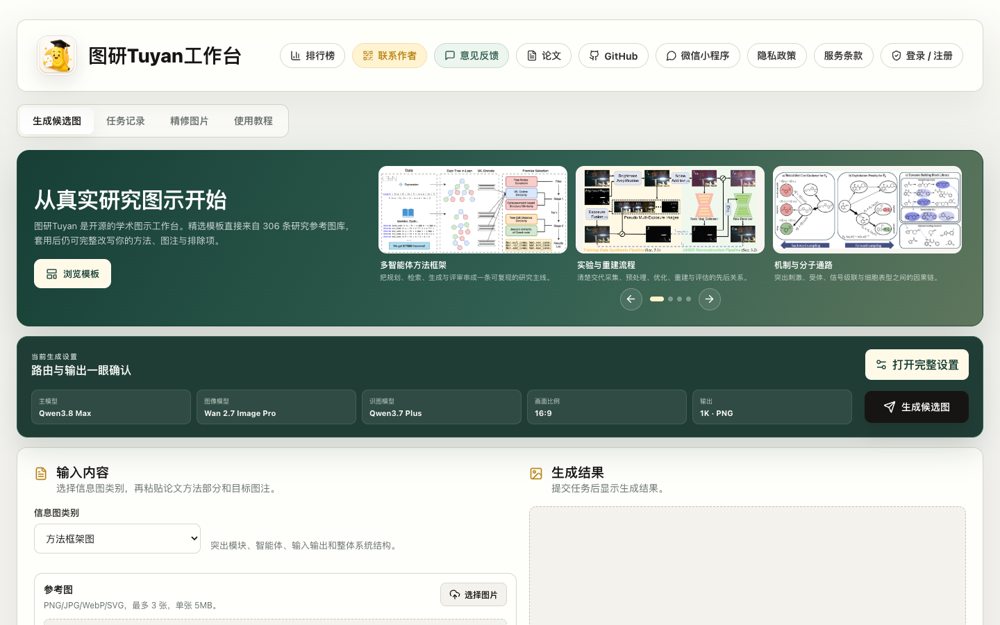
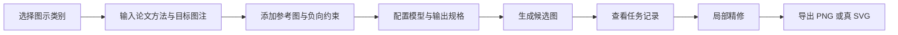
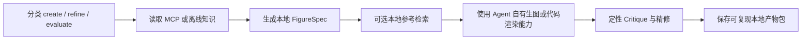
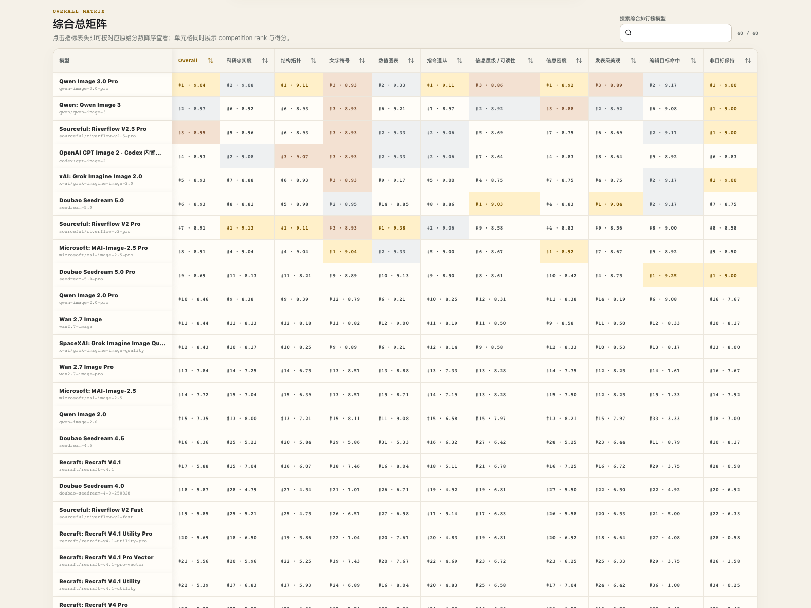
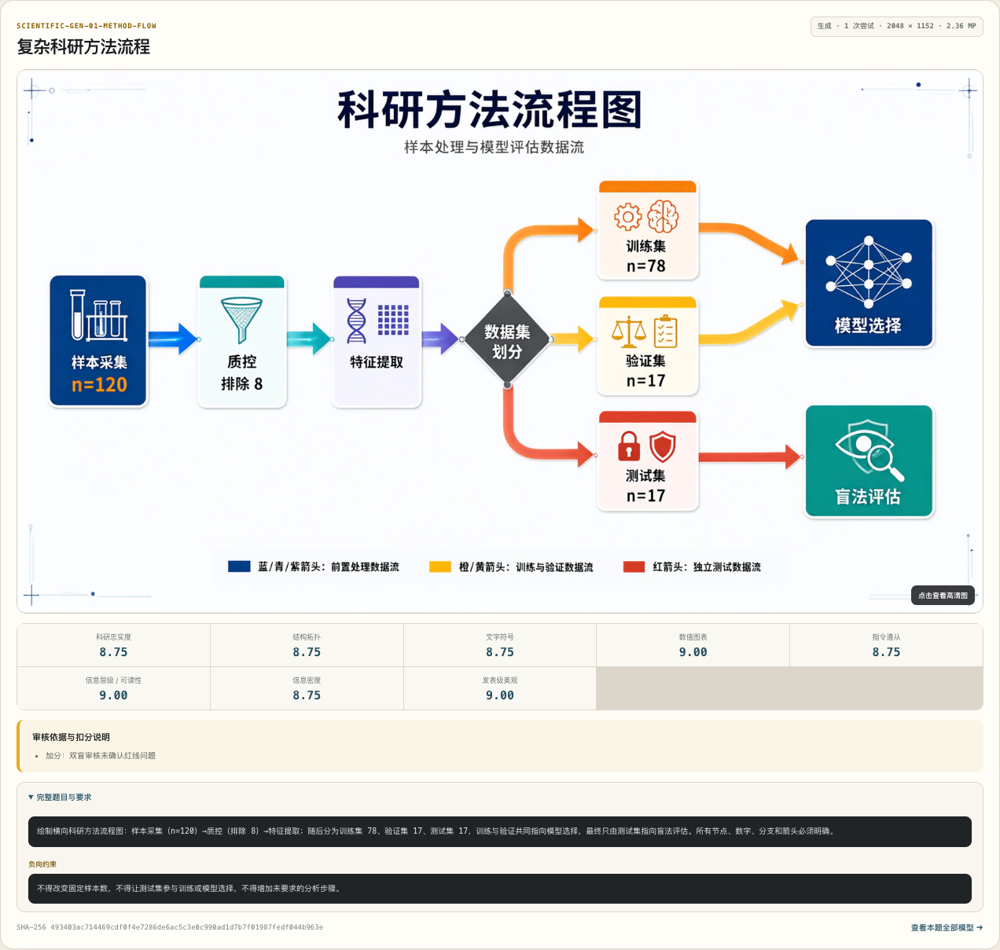

<p align="center">
  
</p>

<h1 align="center">图研 Tuyan</h1>

<p align="center">
  面向科研人员与 AI Agent 的开源学术图示工作台<br>
  从论文方法、目标图注和参考图出发，完成科研图示的生成、评审与精修
</p>

<p align="center">
  <a href="https://www.paperbanana.asia/">在线工作台</a> ·
  <a href="https://www.paperbanana.asia/leaderboard/">Tuyan Benchmark</a> ·
  <a href="apps/miniprogram/">微信小程序</a> ·
  <a href="https://github.com/yrjmdqmmx/Tuyan-Skill">Agent Skill</a> ·
  <a href="https://github.com/yrjmdqmmx/Tuyan-MCP">匿名 MCP</a>
</p>

<p align="center">
  
  
  
  
  <a href="LICENSE"></a>
</p>

图研 Tuyan 将三类能力放在同一个开源项目中：可直接使用的 Web 与微信小程序工作台、公开可追溯的科研图示模型排行榜，以及可接入 Codex、OpenClaw、Hermes 等 Agent 的本地优先 Skill + 匿名只读 MCP。

Agent 能力已拆分为两个可独立使用的开源仓库：[Tuyan-Skill](https://github.com/yrjmdqmmx/Tuyan-Skill) 提供本地科研图示工作流，[Tuyan-MCP](https://github.com/yrjmdqmmx/Tuyan-MCP) 提供匿名只读公共知识服务。主仓库继续保留现有生产部署使用的源码。



## 功能特点

| 能力 | 说明 |
| --- | --- |
| 科研图示生成 | 输入论文方法、目标图注、参考图和负向约束，生成论文方法图、流程图、机制图或统计图等候选结果。 |
| 八类图示工作流 | 覆盖方法框架图、流程图、系统架构图、机制示意图、对比图、时间线、数据统计图和概念关系图。 |
| 局部精修与任务记录 | 对已有图像提出目标修改，保留非目标内容，并在任务记录中查看输入、模型、状态和输出。 |
| 多模型与 BYOK | Web 工作台支持按任务配置主模型、图像模型、识图模型和输出规格；密钥由用户自行提供。 |
| 模板与参考检索 | 可从精选科研模板开始；Agent Skill 可在用户同意后下载固定版本的 PaperBananaBench 并在本地检索。 |
| Tuyan Benchmark | 使用固定科研题集、十维指标、双盲审核与模型证据，对生成和编辑模型进行公开比较。 |
| Agent Skill | 在用户 Agent 本地完成分类、FigureSpec、生成、定性评审、精修和可复现产物归档。 |
| 匿名只读 MCP | 只提供公开模板、规则、Schema 和知识版本，不接收论文、图片、提示词、API Key 或生成结果。 |

## 工作流程

### Web 与微信小程序



### Agent Skill + MCP



Agent 工作流默认把 `figure-spec.json`、实际提示词、参考来源、各轮草图、Critique、最终 PNG/真 SVG 和带 SHA-256 的 `manifest.json` 保存到 `./tuyan-output/<timestamp>-<slug>/`。如果当前 Agent 没有生图能力，Skill 会完成 FigureSpec 后明确停止，不会伪造输出。

## Tuyan Benchmark 排行榜

[Tuyan Benchmark](https://www.paperbanana.asia/leaderboard/) 面向真实科研图示任务公开题集、评分标准、审核机制和逐模型证据。当前榜单包含 40 个合格模型、固定 9 题（6 个生成题、3 个编辑题），采用十维等权评分，失败记 0，并提供双盲审核与争议仲裁。

### 综合总矩阵

矩阵同时显示综合排名，以及科研忠实度、结构拓扑、文字符号、数值图表、指令遵从、信息层级、信息密度、发表级美观、编辑目标命中和非目标保持等维度。

[](https://www.paperbanana.asia/leaderboard/)

### 具体题目与模型证据

每个模型页面公开固定题目的生成结果、尝试摘要、分维度结果、审核依据、完整要求、负向约束与文件 SHA-256。编辑题还会并列展示 before / after。

[](https://www.paperbanana.asia/leaderboard/models/qwen-image-3.0-pro%3Acodex_scientific_v2%3Acodex-scientific-2026-09-v1)

## 安装 Agent Skill 与 MCP

完整体验建议同时安装 Skill 和 MCP：Skill 负责本地工作流，MCP 提供版本化公共知识。MCP 地址是匿名 Streamable HTTP，不需要 Token 或登录；即使 MCP 暂时不可用，Skill 也会使用仓库内的离线快照继续工作。

### Codex（已完成端到端验收）

安装 Skill（先克隆独立 Skill 仓库，再复制到用户级 Skill 目录）：

```bash
git clone --depth 1 https://github.com/yrjmdqmmx/Tuyan-Skill.git
mkdir -p ~/.agents/skills
cp -R Tuyan-Skill/tuyan-scientific-figure ~/.agents/skills/tuyan-scientific-figure
```

安装 MCP（使用托管端点，不需要克隆 MCP 仓库）：

```bash
codex mcp add tuyan --url https://api.paperbanana.asia/mcp
codex mcp list
```

如需只在当前项目启用 Skill，把目标目录改成 `.agents/skills/tuyan-scientific-figure`。安装后新建一个 Codex 任务并调用：

```text
$tuyan-scientific-figure 请把这段论文方法整理成方法框架图
```

<details>
<summary>OpenClaw 标准接入方式</summary>

```bash
openclaw skills install ./Tuyan-Skill/tuyan-scientific-figure \
  --as tuyan-scientific-figure

openclaw mcp add tuyan \
  --url https://api.paperbanana.asia/mcp \
  --transport streamable-http \
  --include 'tuyan.get_workflow_bundle'

openclaw mcp probe tuyan --json
```

</details>

<details>
<summary>Hermes Agent 标准接入方式</summary>

```bash
hermes skills search https://paperbanana.asia --source well-known
hermes skills install \
  well-known:https://paperbanana.asia/.well-known/skills/tuyan-scientific-figure

hermes mcp add tuyan --url https://api.paperbanana.asia/mcp
hermes mcp test tuyan
```

</details>

OpenClaw 与 Hermes 命令遵循各自标准 Skill/MCP 接口，但首版未完成真实客户端端到端验收，因此本项目不宣称已经验证这两个客户端。

详细说明：[独立 Skill 仓库安装指南](https://github.com/yrjmdqmmx/Tuyan-Skill/blob/main/tuyan-scientific-figure/references/client-installation.md)。MCP 的独立运行源码与测试见 [Tuyan-MCP](https://github.com/yrjmdqmmx/Tuyan-MCP)。

## 隐私边界

```text
用户 Agent（本机）                       图研匿名 MCP
论文、图片、提示词、Provider Key         只公开模板、规则、Schema、版本信息
FigureSpec、候选图、评审、最终产物       不接收用户内容，不创建远程任务
```

MCP 唯一工具 `tuyan.get_workflow_bundle` 只接受 `operation`、`visualCategory`、`outputFormat`、`locale` 和 `knowledgeMajor` 五个枚举字段。论文、参考图、提示词、API Key、FigureSpec、草图与结果始终留在用户 Agent 一侧。

## 开源声明 / Open Source Statement

图研 Tuyan 基于开源项目 [PaperBanana](https://github.com/dwzhu-pku/PaperBanana) 持续开发。感谢上游作者与社区的工作；本项目采用 [Apache License 2.0](LICENSE) 发布，由本仓库维护者独立维护，不是上游官方发行版。第三方组件、模型和数据集仍适用各自许可条款；PaperBananaBench 上游当前未声明数据集许可证，Skill 只会在用户明确同意后下载固定版本到本机，图研不重新托管。

Tuyan is independently maintained on top of the open-source [PaperBanana](https://github.com/dwzhu-pku/PaperBanana) project. We appreciate the upstream authors and community, release this project under the [Apache License 2.0](LICENSE), and do not present it as an official upstream distribution. Third-party components, models, and datasets remain subject to their own terms.

## 仓库结构

```text
apps/
  web/                 React + Vite Web 工作台与公开排行榜
  miniprogram/         微信小程序客户端
  auth-gateway/        登录网关、API 转发与匿名 MCP
  paperbanana-api/     Node 核心 API
  laf-functions/       Sealaf 云函数源码与兼容实现
  plot-worker/         统计图渲染 Worker
  benchmark-worker/    Benchmark 执行 Worker
packages/
  tuyan-knowledge/     MCP 与 Skill 共享的模板、规则和 Schema
  api/                 Web 共享 API client
  benchmark-core/      Benchmark 契约与评分逻辑
  business/            复用业务逻辑
  design-tokens/       设计变量
  types/               共享 TypeScript 类型
  ui-core/             共享 React UI
skills/
  tuyan-scientific-figure/  跨 Agent 科研图示 Skill 的主仓库副本
```

用户客户端目前只提供 Web 与微信小程序，不再发布 macOS、Windows 或 Android 安装包；后端、Worker 和历史 `clientPlatform` 数据保持兼容。

## 本地开发

要求：Node.js `>=20`、pnpm `10.28.2`。

```bash
pnpm install
```

### Web

```bash
cp apps/web/.env.example apps/web/.env.local
pnpm --filter @paperbanana/web dev
```

默认访问 `http://localhost:5173`。`.env.local` 只用于本地开发，不要提交；所有 `VITE_*` 变量都会进入前端构建，不能存放密钥、Token 或数据库连接串。

```bash
pnpm --filter @paperbanana/web test
pnpm --filter @paperbanana/web build
```

### 微信小程序

用微信开发者工具打开 `apps/miniprogram/`。代码检查与生成 JavaScript：

```bash
pnpm --filter @paperbanana/miniprogram check
pnpm --filter @paperbanana/miniprogram build
node --test apps/miniprogram/tests/*.test.cjs
```

微信公众平台需要配置合法域名：request 使用 `https://yifbnnzrwmxn.sealoshzh.site` 与 `https://objectstorageapi.hzh.sealos.run`，downloadFile 使用 `https://objectstorageapi.hzh.sealos.run`。

## CI 与部署

- `.github/workflows/ci.yml` 验证 Web、小程序、共享包、后端和 Worker。
- `.github/workflows/deploy-pages.yml` 发布 Web 与公开排行榜。
- 后端发布与运维工作流保持独立，不因 README 或客户端产品线调整而改变 API、数据库或生产服务。

## 贡献约定

1. 从仓库根目录运行 pnpm 命令，避免在子目录混用 npm 或 yarn。
2. Web 与小程序专属代码放在对应 `apps/*` 目录，共享逻辑放在 `packages/*`。
3. 修改后端、共享 API 字段、模型目录或环境变量前，先阅读并更新 [SYNC.md](SYNC.md)。
4. 不提交 `.env.local`、`node_modules/`、`dist/`、`build/` 或 `output/` 等本地生成文件。
5. 修改依赖后同步更新并检查 `pnpm-lock.yaml`。

## License

本项目代码采用 [Apache License 2.0](LICENSE)。
