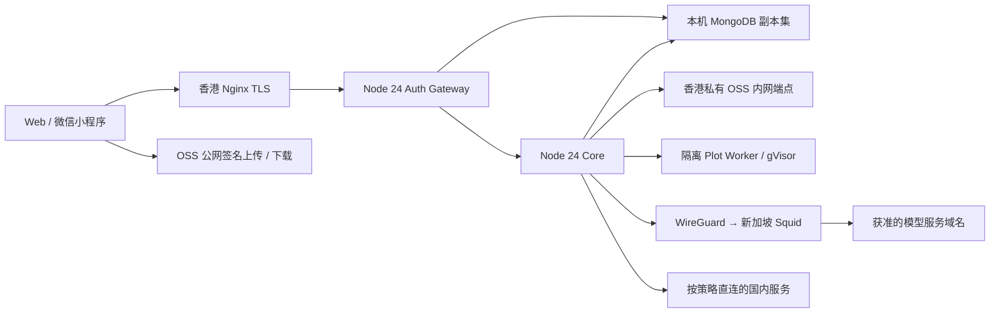

# 当前架构与运行核查

核查日期：**2026-09-27**，只读 SSH、Docker inspect/stats、systemd、Nginx 配置及当前 `/health`、`/ready`。实机配置优先于旧部署文档。证据摘要见 [JSON](2026-09-27-host-evidence.json)；本次代码清理见[交付记录](2026-09-27-platform-retirement.md)。

| 项目 | 香港业务主机 | 新加坡出口主机 |
| --- | --- | --- |
| 操作系统 | Debian 12，Linux 6.1，x86_64 | Ubuntu 24.04.4 LTS |
| CPU / 内存 | 4 vCPU；系统可见 15,936,344,064 bytes（约 14.84 GiB，16 GB 规格） | 2 vCPU；3,669,192,704 bytes（约 3.42 GiB，4 GB 规格） |
| 磁盘 / Swap | 根卷约 84.16 GB，使用 73%；4 GiB Swap，当时未用 | 根卷约 84.15 GB，使用 7%；1 GiB Swap，当时未用 |
| 服务 | Nginx 1.22.1、Docker 29.7.1、Compose 5.3.1 | WireGuard、Squid 6.14，无 Docker |
| 入口 | `api.paperbanana.asia` TLS → `127.0.0.1:13005` | 仅隧道 `10.77.0.2:3128` 接收 HK 代理请求 |

香港为共享主机，存在其他项目容器。因此不修改全局防火墙、不进行全局 Docker prune，也不把整机资源都分配给图研。上表是观察时快照，不能当作压测数据或永久容量承诺。

## 容器与数据

Compose 项目名 `paperbanana-hk`，业务 API/Core/Mongo/Worker 不暴露公网端口。观察到五个运行容器全部 healthy，`mongo-init` 已成功退出是正常状态。

| 服务 | CPU 上限 | 内存上限 | 用途 |
| --- | --- | --- | --- |
| auth-gateway | 0.5 | 512 MiB | Better Auth、会话、所有权、管理身份与 API 转发 |
| paperbanana-api | 1.5 | 3 GiB | 生成/精修、角色路由、加密恢复和对象存储 |
| mongodb | 1 | 3.5 GiB | 单成员副本集，逻辑数据库/用户隔离 |
| plot-worker | 1 | 2 GiB | `runsc`、只读根目录、内网与出站防火墙隔离 |
| benchmark-worker | 1 | 2 GiB | 容器运行；`PAPERBANANA_BENCH_ENABLED=false`，不执行评测 |

Mongo 数据、备份、secret 与控制文件位于 `/opt/paperbanana`，不随 checkout 替换。Mongo 单成员副本集支持事务，但不具备多节点高可用。OSS 为 `oss-cn-hongkong`：服务端 `oss-cn-hongkong-internal.aliyuncs.com`，客户端签名 `oss-cn-hongkong.aliyuncs.com`，两者不能混用。实时 readiness 的 Mongo、私有 OSS 检查均 ready；本轮没有上传/删除生产对象。

现网 Core/Benchmark 的代码版本为 `9a52aa7414c72a02fcaf285dbb020dbdc68c6c20`。本地 v3.8.1 与本次退役清理均未发布，不应由源码推断现网已更新。

## 出口与部署

Core 现网模式为 `sg-required`，WireGuard 最近握手正常。Squid 仅允许 HK 隧道来源、CONNECT 443，拒绝 IP 字面量和私网目的地；允许列表采用逐主机规则，其中 BFL 使用已审计的 `.bfl.ai` 子域规则。国内直连与海外代理的精确分类以 [Core 策略](../../apps/paperbanana-api/src/provider-egress.ts) 与 [SG 配置](../../deploy/sg-egress)为准。代理失败不降级到香港直连。

发布入口为手动 GitHub Actions 和 [项目部署脚本](../../deploy/hk-single-host/README.md)：固定源码 → GHCR 镜像 digest → 锁定清单 → 项目锁、维护/排空、停止旧单副本 → 启动/验收。Web 单独发布 Pages，小程序单独走微信审核。CI 只做测试/构建，不等于生产发布。

Sealos / Sealaf 已退役，没有平台回退路径。恢复仅在当前架构中选择已验证镜像与相容数据方案。旧历史记录见[归档索引](../archive/platform-retirement/README.md)，不能据此操作生产。

## 监控、缺口与发布前工作

- 已看到健康、出口、DirectMail 出站规则刷新（五分钟）和每日 Mongo 备份 timers 启用。**但 2026-09-27 03:24–03:26 CST 的备份作业退出码 3：OSS PutObject 在内网目标 `100.115.61.4:443` 连接超时。** 健康监控明确报告 `last daily backup did not succeed`；不能将 timer 启用误当备份成功，也不能把该告警归咎于旧域名。网络/备份凭据/目标桶的进一步排障与重新备份尚未执行，不能假称已修复。健康监控覆盖 API/readiness、容器、Mongo、卡住的任务、备份时效、TLS 与 Nginx 5xx；事件通过独立 RAM 的 CloudMonitor 权限上报。
- 本地已删除旧平台域名探测；安装在服务器的脚本不会因本地修改自动更新。发布时需通过已有安装流程同步监控资产。
- 现网 SG ACL **尚无 `api.novita.ai`**。本地 v3.8.1 已增加，正式启用 Novita 前须单独批准同步出口并做无付费连通验收。
- 现网仍有健康响应 `laf` 别名和 `PAPERBANANA_STRICT_OBJECT_STORAGE=true`。本次源码已删除别名与可切换的存储降级开关，正式更新时需同步网关/Core/监控，清理安装环境中无效的旧开关。生产严格存储行为保持。
- 微信控制台合法域名、已发客户端版本、提供商账户权限和账单未在本轮重新登录核实；本地测试不代表真实调用或微信发布。
- 未查询旧云平台账户的资源/计费清单；也未改变其资源。无法据此声称已停止所有历史账单，后续资源销毁需要单独授权。
